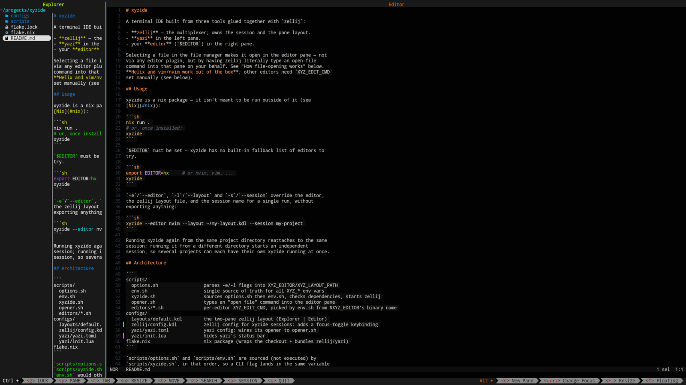

# xyzide

A terminal IDE built from three tools glued together with `zellij`: a file
manager on one side, your editor on the other, tied together by a `zellij`
session and a couple of scripts. No editor plugin required — selecting a
file in the file manager opens it in the editor pane.



- **zellij** — the multiplexer; owns the session and the pane layout.
- **yazi** in the left pane, as the file manager.
- your **editor** (`$EDITOR`) in the right pane.

Selecting a file in yazi makes it open in the editor pane — not via any
editor plugin, but by having zellij literally type an open-file command into
that pane on your behalf (see [How file-opening works](#how-file-opening-works)).
**Helix and vim/nvim work out of the box**; other editors need `XYZ_EDIT_CMD`
set manually (see [Editor profiles](#editor-profiles)).

## Installation

xyzide is packaged as a Nix flake and isn't meant to be built or run outside
of Nix.

### On NixOS

Add it as a flake input and put the package on your system (or into a
home-manager profile):

```nix
{
  inputs.xyzide.url = "github:ashqqy/xyzide";

  outputs = { self, nixpkgs, xyzide, ... }: {
    nixosConfigurations.<host> = nixpkgs.lib.nixosSystem {
      # ...
      modules = [
        {
          environment.systemPackages = [
            xyzide.packages.${pkgs.system}.default
          ];
        }
      ];
    };
  };
}
```

For home-manager, add the same package to `home.packages` instead. Rebuild
your system (`nixos-rebuild switch`) or home-manager generation, then `xyzide`
is on your `$PATH`.

To just try it without touching your system config:

```sh
nix run github:ashqqy/xyzide
```

### Without NixOS

Any machine with Nix installed works the same way, NixOS or not:

1. Install Nix if you haven't already (the [official installer](https://nixos.org/download)
   works fine).
2. Make sure flakes are enabled — add to `~/.config/nix/nix.conf`
   (create it if it doesn't exist):

   ```
   experimental-features = nix-command flakes
   ```

3. Run it directly, or install it into your user profile:

   ```sh
   nix run github:ashqqy/xyzide          # one-off
   nix profile install github:ashqqy/xyzide   # puts `xyzide` on $PATH permanently
   ```

### From a local checkout

```sh
git clone git@github.com:ashqqy/xyzide.git
cd xyzide
nix run .
# or: nix profile install .
```

## Usage

`$EDITOR` must be set — xyzide has no built-in fallback list of editors to
try.

```sh
export EDITOR=hx     # or nvim, vim, ...
xyzide
```

`-e`/`--editor`, `-l`/`--layout` and `-s`/`--session` override the editor,
the zellij layout file, and the session name for a single run, without
exporting anything:

```sh
xyzide --editor nvim --layout ~/my-layout.kdl --session my-project
```

Running xyzide again from the same project directory reattaches to the same
session; running it from a different directory starts an independent
session, so several projects can each have their own xyzide running at once.

## Keybindings

`configs/zellij/config.kdl` is a zellij config scoped to xyzide sessions
only (passed to zellij via `--config`, so it never touches your own
`~/.config/zellij/config.kdl`). On top of zellij's regular defaults it adds:

- `Alt y` — toggle focus between the Explorer (yazi) pane and whatever pane
  you jumped from, from anywhere in the session (not just the Editor pane).
  Runs `scripts/yazi-toggle.sh`, which asks zellij (`list-panes --json`) for
  the currently focused pane: if it's not Explorer, it remembers that pane
  and focuses Explorer; if it is, it focuses whatever was remembered. This
  runs in a throwaway 1x1 floating pane that closes itself immediately, so
  it never disturbs the layout.
- `support_kitty_graphics_protocol true` is set explicitly, since zellij's
  auto-detection of it (required for yazi's image previews) doesn't always
  succeed.

`configs/yazi/init.lua` hides yazi's status bar — there's no config toggle
for it, so it overrides yazi's `Status`/`Tab` components directly — and
hands that row back to the file list.

## Architecture

```
scripts/
  options.sh                 parses -e/-l flags into XYZ_EDITOR/XYZ_LAYOUT_PATH
  env.sh                     single source of truth for all XYZ_* env vars
  xyzide.sh                  sources options.sh then env.sh, checks dependencies, starts zellij
  opener.sh                  types an "open file" command into the editor pane
  yazi-toggle.sh            Alt+y: toggles focus between Explorer and the last pane
  editors/*.sh               per-editor XYZ_EDIT_CMD, picked by env.sh from $XYZ_EDITOR's binary name
configs/
  layouts/default.kdl        the two-pane zellij layout (Explorer | Editor)
  zellij/config.kdl          zellij config for xyzide sessions: adds a focus-toggle keybinding
  yazi/yazi.toml             yazi config: wires its opener to opener.sh
  yazi/init.lua              hides yazi's status bar
flake.nix                    nix package (wraps the checkout + bundles zellij/yazi)
```

`scripts/options.sh` and `scripts/env.sh` are sourced (not executed) by
`scripts/xyzide.sh`, in that order, so a CLI flag lands in the same variable
`env.sh` would otherwise default from an environment variable — one place
that computes every default.

## Environment variables

Everything xyzide itself defines is prefixed `XYZ_`. Variables without that
prefix (`EDITOR`, `YAZI_CONFIG_HOME`) belong to a tool being integrated with,
not to xyzide.

| Variable | Default | Meaning |
|---|---|---|
| `XYZ_SHARE` | *(none — set by the nix package)* | where `configs/` and `scripts/` live; xyzide refuses to start if this isn't set |
| `XYZ_EDITOR` | `$EDITOR` (or `-e`/`--editor`) | the editor binary to launch; **required**, no fallback |
| `XYZ_EDIT_CMD` | picked from `scripts/editors/<binary>.sh`; **required** if there's no profile for your editor | command typed into the editor to open a file; `%s` is replaced with the path |
| `XYZ_EDIT_PRE` | picked from `scripts/editors/<binary>.sh`, defaults to Escape (`27`) | byte written before `XYZ_EDIT_CMD`; set to `''` by modeless editors (nano, emacs) that treat Escape as a Meta prefix instead of "leave this mode" |
| `XYZ_LAYOUT_PATH` | `$XYZ_SHARE/configs/layouts/default.kdl` (or `-l`/`--layout`) | zellij layout file |
| `XYZ_OPENER` | `$XYZ_SHARE/scripts/opener.sh` | script yazi calls to open a file in the editor; fixed, not user-overridable |
| `XYZ_SESSION_NAME` | `xyzide-<hash-of-the-directory>` (or `-s`/`--session`) | zellij session name; each directory gets its own by default, so several projects can run at once |

`YAZI_CONFIG_HOME` is also set (to `$XYZ_SHARE/configs/yazi`) but isn't a
xyzide variable — it's yazi's own config-directory variable.

## How file-opening works

`configs/yazi/yazi.toml` registers `scripts/opener.sh` as yazi's
opener for every file. That script:

1. looks up the pane named `Editor` (via `zellij action list-panes --json`)
   and focuses it by ID,
2. writes `XYZ_EDIT_PRE` if it's non-empty (Escape by default, to leave
   whatever mode a modal editor is in),
3. types `XYZ_EDIT_CMD` with the file path substituted for `%s`,
4. presses Enter,
5. focuses back to the pane named `Explorer`.

This is why `XYZ_EDIT_CMD` (and `XYZ_EDIT_PRE`) have to match your editor's
own command syntax. Panes are found by the `name=` set on them in
`configs/layouts/default.kdl`, not by position — so this keeps working even
with extra panes open in the session.

### Editor profiles

`XYZ_EDIT_CMD` isn't set directly — `env.sh` takes the basename of
`$XYZ_EDITOR` and looks for `scripts/editors/<that-name>.sh`. If found, it's
sourced to set `XYZ_EDIT_CMD` (and optionally `XYZ_EDIT_PRE`). If you've
already set `XYZ_EDIT_CMD` yourself, that wins and no profile is loaded. If
neither applies, xyzide refuses to start — there's no guessed default, so an
editor without a profile needs `XYZ_EDIT_CMD` set by hand.

Shipped profiles (one file per binary name, so the lookup stays a plain
filename match):

| Profile(s) | `XYZ_EDIT_CMD` | `XYZ_EDIT_PRE` |
|---|---|---|
| `helix.sh`, `hx.sh` | `:open "%s"` | Escape (default) |
| `vim.sh`, `nvim.sh`, `vi.sh` | `:e %s` | Escape (default) |
| `nano.sh` | Read File (`^R`), toggle new buffer (`M-f`), then the path | none — Escape is nano's Meta prefix |
| `emacs.sh` | find-file (`C-x C-f`), then the path | none — Escape is emacs's Meta prefix |

To add another editor, drop a `scripts/editors/<binary-name>.sh` that
exports `XYZ_EDIT_CMD`, and `XYZ_EDIT_PRE=''` if it's not a modal editor
where Escape safely means "cancel".

## Nix

`flake.nix` builds a package that bundles `zellij`, `yazi`, and yazi's
optional preview tools (`7zz`, `jq`, `poppler-utils`, `resvg`, `ffmpeg`,
`imagemagick`) so the installed `xyzide` binary works without any of them
already being on `$PATH`. The editor is deliberately **not** bundled —
xyzide always launches whatever `$EDITOR` points at in your own environment.

Supports `x86_64-linux`, `aarch64-linux`, `x86_64-darwin`, `aarch64-darwin`.

### Image previews under zellij

Yazi's image preview needs the outer terminal to render either the Kitty
graphics protocol or Sixel, but zellij doesn't reliably pass either through
to the real terminal — this is a known zellij limitation, not something
`configs/yazi/yazi.toml` can work around. If neither protocol is available,
yazi falls back to `ueberzugpp` (a compositor overlay, Linux-only, needs
Hyprland/Sway/Niri/Wayfire) if it's on `$PATH`, then further to `chafa`-style
ASCII art, or no preview at all. `ueberzugpp` isn't bundled by this flake —
install it yourself if you want that fallback.
